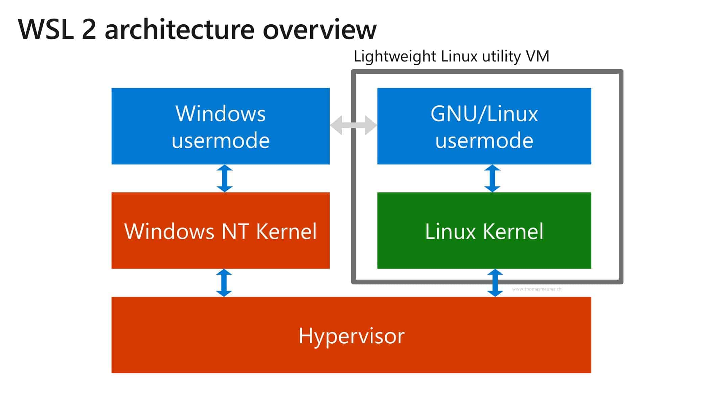

# DataScience in windows 10

Dear Data Scientist, 

Do you still suffer from the "chaos evil" Windows operating system as your first dev place ?
- **git** doesn't work as what I expected...
- **ssh** connection failed and Putty looks stupid....
- **conda** works well at first but pip might get destroyed right after update...
- **Tensorflow** seems friendly to Windows, a lot pretrained models in tensorhub can be used only in Linux kernel....
- Or just get **tired of windows** ? 

Here is some Good News:
- **WSL2** is totally different from the first version. It has a full capacity linux kernel. 
- Many available Linux Kernels: SUSE / Debian / ubuntu / etc... 

Here, I've got a full tutorial for how to use Windows Subsystem Linux version 2 (WSL2) with VS code 

Linux on Windows, here we go !

Good luck !

## Table of Content

- [DataScience in windows 10](#datascience-in-windows-10)
  - [Table of Content](#table-of-content)
  - [What is this WSL ?](#what-is-this-wsl-)
  - [Tutorial 1 : Get your WSL2 and install Linux distribution](#tutorial-1--get-your-wsl2-and-install-linux-distribution)
    - [1. Update Windows 10](#1-update-windows-10)
    - [2. Install and Set WSL-2](#2-install-and-set-wsl-2)
    - [3. Install Linux Distribution from Microsoft Store](#3-install-linux-distribution-from-microsoft-store)
  - [Tutorial 2 : Set up Data Science Environment in WSL2](#tutorial-2--set-up-data-science-environment-in-wsl2)
    - [1. Configuration for Windows 10](#1-configuration-for-windows-10)
    - [2. Configurtion for WSL](#2-configurtion-for-wsl)
  - [Tutorial 3 : Best Terminal (Option)](#tutorial-3--best-terminal-option)
- [TODO list](#todo-list)


## What is this WSL ?
> wikipedia : [WSL](https://en.wikipedia.org/wiki/Windows_Subsystem_for_Linux)  




Intuitively, the WSL2 is a lightweight Linux Vitual Machine based on the Hypervisor, same as Windows. 

Advantages is: 
- Shared RAM and ROM, 

Disadvantage is : 
- Shared RAM and ROM lol...

(I don't know much about operating system, tell me if I say something wrong xD)

## Tutorial 1 : Get your WSL2 and install Linux distribution

**IMPORTANT** : 
* Windows 10 s can't have a WSL !!!! Buy a pro version key, pls (or hack it...)
* If you have already had a WSL version 1, this tutor does work for your case ! 

### 1. Update Windows 10

Check Windows version
```
Open Run :  win + R 
type : winver  
select : OK
```


if Windows 10 version is lower than version 2004, Build 19041.
- Use [Get Windows Update Assitant](https://www.microsoft.com/software-download/windows10)


### 2. Install and Set WSL-2

Go to windows setup, and turn on the Developer Mode 


It will take a couple of time.  Don't worry! 

After that: 

Open PowerShell as Admin 

- Run following command to enbale WSL

```PowerShell
dism.exe /online /enable-feature /featurename:Microsoft-Windows-Subsystem-Linux /all /norestart
```

- Run followeing commande to enable Virual Machine Platform for WSL-2

```PowerShell
dism.exe /online /enable-feature /featurename:VirtualMachinePlatform /all /norestart
```

PS : you may need to **restart** your machine for several times, it's ok !

- Run following commande to Set WSL 2 as default 

```PowerShell
wsl --set-default-version 2
```

### 3. Install Linux Distribution from Microsoft Store

Choice what u want and install it! 


## Tutorial 2 : Set up Data Science Environment in WSL2

### 1. Configuration for Windows 10

### 2. Configurtion for WSL


## Tutorial 3 : Best Terminal (Option)


# TODO list

- [x] Install WSL
- [ ] Configuration WSL and Windows10
- [ ] Windows Terminal (Preview)